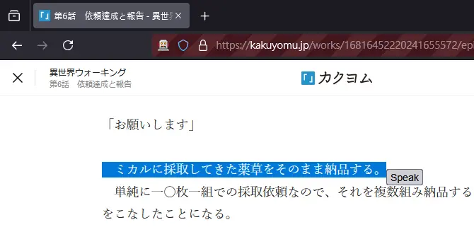

# Browser-TTS




The core functionality is triggered when a user selects text in the browser and clicks a dynamically injected "Speak" button. This repository implements a system that enables text-to-speech (TTS) functionality for selected text within a web browser using Selenium, Firefox, and a local Flask server.  

## Requirement

* Win10 have japanese lang installed
* Browser driver such gecko
* env 
```
pip install -r requirements.txt
```

## Usage

**Start the Flask server:**

    ```bash
    python tts_server.py
    ```

**Run the frontend script:**

    ```bash
    python frontend.py
    ```

Flow:
1.  Open a web page in the Firefox instance launched by the script.
2.  Select any text on the page.
3.  A "Speak" button will appear near the selected text.
4.  Click the "Speak" button.
5.  The selected text will be spoken aloud.


## Configuration

Setting file ```config.ini``` :

```
[Settings]
gecko_driver_path = <path-to-gecko>
```

## License

This project is licensed under the [MIT License](LICENSE).